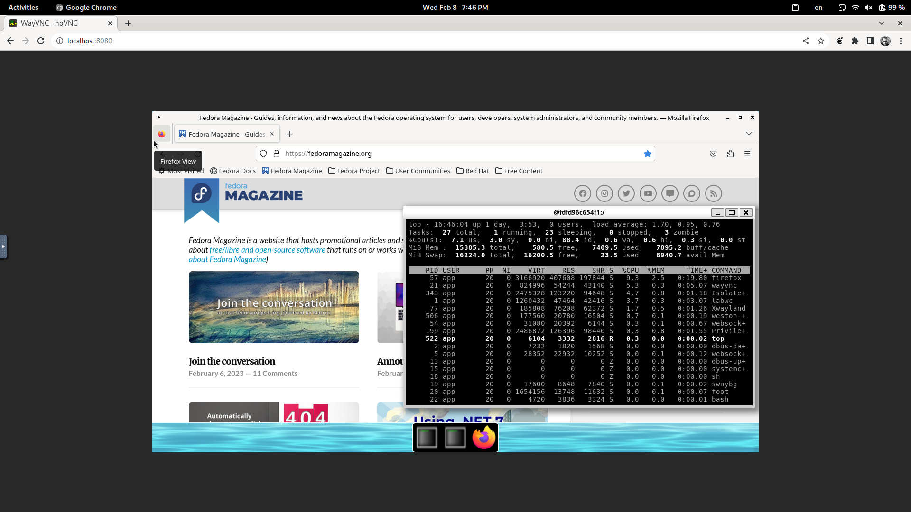
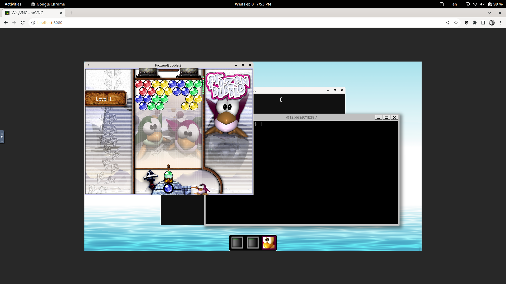

# Containerized Wayland over VNC and Web




## Run Linux GUI Applications from inside Docker/Podman 

Start this container using podman or docker like this then open your browser on [localhost:8080](http://localhost:8080/)

```
podman run --rm -ti -p 8080:8080 -p 5900:5900 containerized-gui-wayland
```

## Hot Keys

We have configured both `sway` and `labwc` to have the following hot keys

* use ALT+ENTER to open terminal
* use ALT+R to run available applications via `wofi`
* use ALT+F3 to run a commend via `bemenu`

## How it works

We ship `sway` the `i3`-like `Wayland` compositor and `wayvnc`. 
You can use any [wlroots](https://gitlab.freedesktop.org/wlroots/wlroots) based compositor like:

* sway
* [labwc](https://github.com/labwc/labwc) - openbox-like intutive (NOTE: `export WAYLAND_DISPLAY=wayland-1`)
* hikari
* [phoc/phosh](https://www.youtube.com/watch?v=LAUPZhRPHAY&ab_channel=YoctoProject)
* river
* wayfire

## Customizations

### build image

```
podman build -t containerized-gui-wayland .
```

### roll your own application graphical application

Examples

#### frozen-bubble

have a `Dockerfile` like this

```
# Dockerfile-frozenbubble
FROM containerized-gui-wayland
USER root
RUN microdnf install -y --setopt install_weak_deps=0 lavalauncher frozen-bubble ; microdnf clean all

ADD lavalauncher-frozen-bubble.config /etc/lavalauncher/lavalauncher.config
USER app
```

build it with

```
podman build -t containerized-wayland-frozen-bubble -f Dockerfile-frozenbubble .
```

#### firefox

have a `Dockerfile` like this

```
# Dockerfile-firefox
FROM containerized-gui-wayland
USER root
RUN microdnf install -y --setopt install_weak_deps=0 lavalauncher dnf ; \ 
    dnf swap -y --setopt install_weak_deps=0 systemd-standalone-tmpfiles systemd ; \
    dnf install --setopt install_weak_deps=0 -y firefox ; \
    microdnf clean all; \
    dnf clean all
ADD lavalauncher-firefox.config /etc/lavalauncher/lavalauncher.config
USER app
```

```
podman build -t containerized-wayland-firefox -f Dockerfile-firefox .
```

### Panels and docks

you can use `lavalauncher` and add it to `/etc/sway/config.d/autostart` and `/etc/xdg/labwb/autostart`, for more see

* https://github.com/solarkraft/awesome-wlroots


```
# /etc/lavalauncher/lavalauncher.config
# and run it with in your autostart
# lavalauncher -c /etc/lavalauncher/lavalauncher.config 

global-settings
{
	watch-config-file = true;
}

bar
{
    button
    {
       image-path = /usr/share/weston/icon_terminal.png;
       command = weston-terminal;
    }

    button
    {
        image-path = /usr/share/icons/hicolor/48x48/apps/frozen-bubble.png;
        command = frozen-bubble --no-sound;
    }
}
```

### Wayland over RDP protocol

Customize this container to run `weston` like this

```
weston --rdp4-key=rsa -B rdp-backend.so
```

* [Tizen on Weston_RDP_access](https://wiki.tizen.org/Weston_RDP_access)
* [weston-rdp manual](https://man.archlinux.org/man/community/weston/weston-rdp.7.en)


